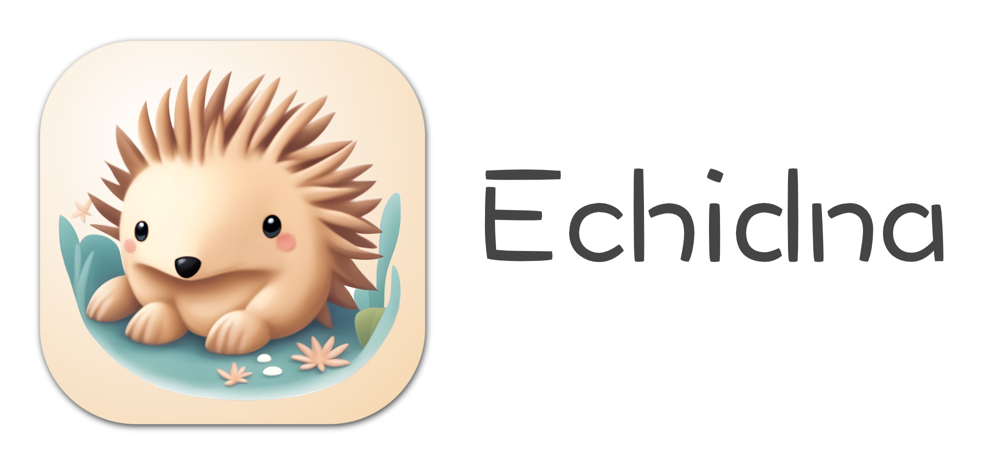
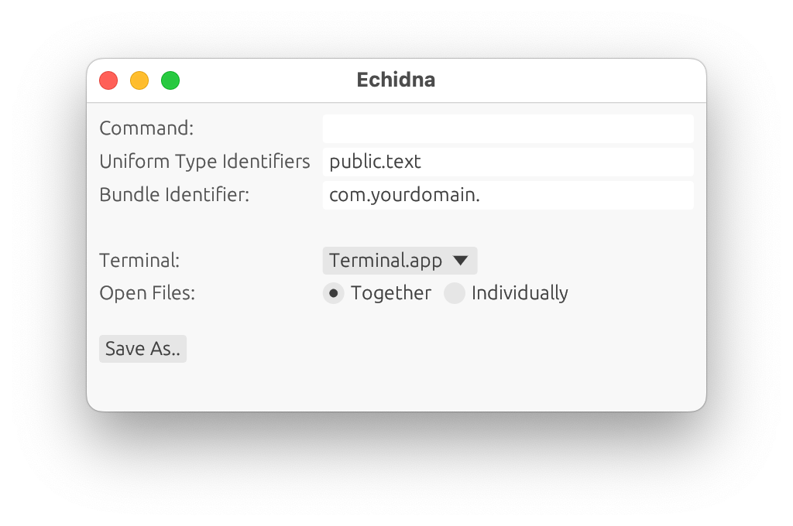

Echidna is a Mac app for generating "shim applications" that allow opening files with terminal programs by double clicking on the files' icons. For example, you could generate a shim app to open double-clicked source files in `(n)vim` or `emacs`. Files can also be opened with the selected terminal application by dragging to the shim's icon in the Finder or Dock or selecting the shim app from the `Open With` menu after right-clicking on the file icon. Echidna's name, like its functionality, is inspired by [Platypus](https://sveinbjorn.org/platypus) ([Github](https://github.com/sveinbjornt/Platypus)), a wonderful Mac app for wrapping scripts in GUIs.

## Usage

After launching Echidna, first fill out the fields:

- **Command**: The terminal program to execute. The files, space-delimited, will be appended to this string and passed to the terminal. Only Bash-compatible commands are supported at the moment (due to the quoting required for the command and passed file paths).
- **Extensions**: Optionally add extensions for the shim app to support. Adding extensions makes your shim app appear in the `Open With` menu for files with supported extensions, but will prevent files with other extensions from being dragged to your shim app. Files with other extensions can still be opened by double-clicking if your shim app is selected in the `Open With` -> `Other...` dialog (You may have to select `All Applications` in the `Enable` drop-down)
- **Open Files: () Together, () Individually**: If multiple files are opened simultaneously, should they all be passed to a single instantiation to the command (space-delimited), or should each open in it's own window?
- **Identifier**: The bundle identifier for the shim app. This can be any unique string, but is usually a reverse URL withe app name as the final component.

Then click `Save As..`, provide a file name and directory, and click `Save`. You can then set your shim app as the `Open With` handler, or launch it to provide a draggable target in the dock bar (no windows will appear after being launched, and launching isn't necessary for other use pattern).

## Repo Structure

- `echidna-shim`: `bin`. The binary that runs within the generated shim app, receiving the double-clicked files and launching the terminal session.
- `echidna_lib`: `lib`. The library with the core Echidna functionality of generating specialized shim apps.
- `echidna-cli`: `bin`. A command line tool to generate shim apps. Essentially a thin wrapper around `echidna-lib`. By default, `echidna-cli` looks for an `echidna-shim` binary in the same directory, but this can be overwritten with a command-line flag. `echidna-cli` _should not_ be run with `cargo run`, as Cargo is not aware of the dependency between `echidna-cli` and `echidna-shim`, and a stale version of `echidna-shim` may be used.
- `echidna`: `bin`. A GUI tool to generate shim apps. Essentially a (slightly less) thin wrapper around `echidna-lib`.

## Building

**TLDR: Run `./build.sh [--debug | --release]`**

`build.sh` runs `cargo build --all`, then `./echidna/scripts/make-app.sh`, which builds `Echidna.app` (`target/{BUILD_MODE}/Echidna.app`), a Mac app bundle that includes `echidana` and `echidna-shim`.

`cargo run` _should not_ be used, see `echidna-cli` above.
