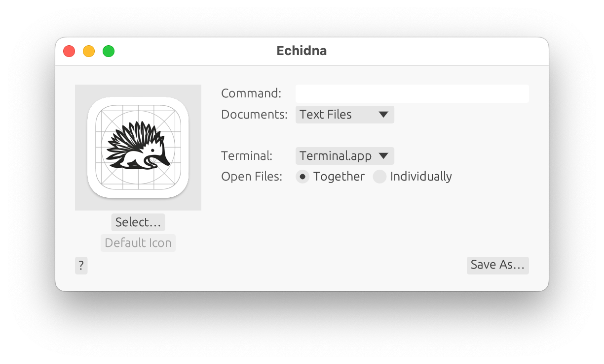

# Echidna

Echidna is a Mac app for generating shim applications that allow opening files with terminal programs by double clicking on them. For example, you could generate a shim to open double-clicked source files in `(n)vim` or `emacs`. Files can also be opened with the selected terminal application by dragging to the shim's icon in the Finder or Dock or selecting the shim from the `Open With` menu after right-clicking on the file icon. Echidna's name, like its functionality, is inspired by [Platypus](https://sveinbjorn.org/platypus), a wonderful Mac app for wrapping scripts in GUIs.

## Building

Build with `make`, not `cargo build` or `cargo run` (This is to bypass cargo's lack of binary dependencies). `Echidna.app` will be generated in `target/release/Echidna.app`

## Usage

After launching Echidna, first fill out the fields:

- **Command**: the shell command to execute. The paths of the double-clicked files will be appended to this, so if your terminal application supports `--` to separate positional arguments from flags, it's recommended (e.g., if you want to open your files with `nvim`, type `nvim --` as the command, so a file named `-example.txt` opened rather than putting `nvim` in to `ex` mode).
- **Extensions**: optionally add extensions for the shim to support. Adding extensions makes your shim appear in the `Open With` menu for files with supported extensions, but will prevent files with other extensions from being dragged to your shim. Files with other extensions can still be opened by double-clicking if your shim is selected in the `Open With` -> `Other...` dialog (You may have to select `All Applications` in the `Enable` drop-down)
- **Open Files: () Together, () Individually**: if multiple files are opened simultaneously, should they all be passed to a single instantiation to the command (space-delimited), or should each open in it's own window?

Then click `Generate!`, provide a file name and directory, and click `Save`. You can then set your shim as the `Open With` handler, or launch it to provide a draggable target in the dock bar (no windows will appear after being launched, and launching isn't necessary for other use pattern).

